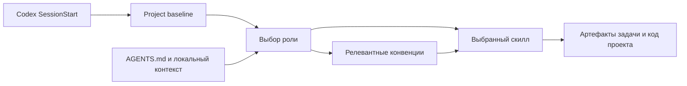

# ErgocodeAI Agent Framework

ErgocodeAI учит ваших ИИ-агентов работать по [Эргономичному подходу](https://ergowiki.azhidkov.pro/):

1. вести разработку через тесты (TDD);
2. писать быстрые, надёжные и устойчивые к рефакторингу тесты;
3. разделать сложную логику (бизнес-логику, вычисления, трансформации) и ввод-вывод (действия, эффекты);
4. декомпозировать систему на небольшие модули с низкой сцепленностью;

> [!WARNING]
> Фреймворк находится в активной разработке.
> Структура, контракты скиллов и процесс установки могут изменяться без обратной совместимости, поэтому в рабочих проектах рекомендуется фиксировать конкретную ревизию.

> [!NOTE]
> На данный момент соглашения, примеры и готовые процессы в первую очередь ориентированы на Kotlin и Spring Boot.
> Общие архитектурные и процессные идеи не зависят от стека, но их применение с другими технологиями потребует адаптации контекста.

> [!NOTE]
> На данный момент фреймвору ориентирован в первую очередь на Codex и модели OpenAI.

## Варианты применения

### 1. Неявный режим

Подключите фреймворк к репозиторию и продолжайте ставить агенту задачи как обычно.
При старте сессии Codex загрузит базовый контекст, а затем будет выбирать роль и подгружать относящиеся к задаче соглашения.

Этот режим подходит, когда нужен единый инженерный фон без жёсткого процесса работы.

### 2. Ad hoc

Вызывайте готовые скиллы явно, самостоятельно выбирая нужные действия и их порядок.

Базовый поток реализации одного изменения:

1. Спроектировать проверку наблюдаемого поведения через [`$design-test-case`](src/skills/design-test-case/SKILL.md).
2. Реализовать проверку через [`$code-test-case`](src/skills/code-test-case/SKILL.md).
3. Выполнить тест и подтвердить, что он скомпилировался, был исполнен и упал из-за отсутствующего поведения.
4. Сделать проверку зелёной минимальным изменением production-кода через [`$fix-red-case`](src/skills/fix-red-case/SKILL.md).
5. Проверить и улучшить получившийся инкремент через [`$refactor-case`](src/skills/refactor-case/SKILL.md).

Перед основным циклом при необходимости можно описать API через [`$describing-rest-api`](src/skills/describing-rest-api/SKILL.md) или найти связанные участки кода через [`$collect-code-anchors`](src/skills/collect-code-anchors/SKILL.md).
Перед изменением production-кода можно подготовить план исправления одного красного кейса через [`$plan-test-case-fixing`](src/skills/plan-test-case-fixing/SKILL.md).
$fix-red-case использует применимый план из текущего запроса, при его отсутствии — однозначно соответствующий кейсу план из директории задачи, и только затем планирует исправление заново.
При наличии директории задачи скилл синхронизирует подтверждённые изменения требований и решения с соответствующими брифами.

### 3. Lightweight SDD

Храните постановку, проектные решения и прогресс задачи в директории `devlog/<task-id>-<slug>` и реализуйте спецификацию последовательными вертикальными инкрементами.

#### Подготовка задачи

1. Создайте рабочую директорию через [`$init-task-workdir`](src/skills/init-task-workdir/SKILL.md).
2. Опишите требования и границы задачи в `010-task-brief.md`.
3. При необходимости добавьте артефакты `020-*` с текущим API, тестами, компонентами и другими существенными сведениями о реализации.
4. Зафиксируйте выбранное направление решения в `030-solution-brief.md` и добавьте необходимые целевые артефакты `030-*`.
5. Разбейте реализацию на проверяемые вертикальные инкременты в `todo.md`.

Минимальная директория задачи имеет следующий вид:

```text
devlog/123-example-task/
├── 010-task-brief.md
├── 030-solution-brief.md
└── todo.md
```

#### Итерация инкремента

1. Выберите следующий минимальный инкремент из спецификации и `todo.md` через [`$select-next-increment`](src/skills/select-next-increment/SKILL.md).
2. Спроектируйте проверку поведения через [`$design-test-case`](src/skills/design-test-case/SKILL.md) и при необходимости согласуйте изменения API через [`$describing-rest-api`](src/skills/describing-rest-api/SKILL.md).
3. Реализуйте тест через [`$code-test-case`](src/skills/code-test-case/SKILL.md).
4. Выполните тест и подтвердите, что он скомпилировался, был исполнен и упал из-за отсутствующего поведения.
5. Сделайте тест зелёным минимальным изменением production-кода через [`$fix-red-case`](src/skills/fix-red-case/SKILL.md).
6. Выполните ограниченный рефакторинг зелёного инкремента через [`$refactor-case`](src/skills/refactor-case/SKILL.md).
7. Обновите `todo.md` и повторите цикл для следующего инкремента.

Каждый инкремент изменяет спецификацию и код только в пределах выбранного поведения.

#### Автоматизация инкрементов

> [!WARNING]
> Этот режим очень жадный до токенов и может сжечь весь недельный лимит на одной задаче.

Подготовленную директорию задачи можно передать [`$implement-task-tdd`](src/skills/implement-task-tdd/SKILL.md).
Скилл последовательно проводит каждый минимальный инкремент через выбор, проектирование теста и API, red, green и refactor, после чего переходит к следующему незавершённому поведению.
После каждой стадии он останавливается для явного подтверждения человеком.

Автоматизация требует от агента поддержки отдельных последовательных субагентов и контрольных остановок.

### 4. «Вдохновительный» режим

Используйте структуру фреймворка как референс, а соглашения и процесс перепишите под собственную инженерную культуру.
Можно заимствовать только разделение на роли, роутинг контекста, конвенции, скиллы и артефакты, не принимая Эргономичный подход целиком.

## Доработка контекста

В случае если агент допустил ошибку, используйте `$fix-framework-context` или `$fix-project-context` для коррекции контекста, чтобы предотвратить повторение ошибки в будущем.

- [`$fix-framework-context`](src/skills/fix-framework-context/SKILL.md) изменяет общий runtime-контекст ErgocodeAI под `src/**`;
- [`$fix-project-context`](src/skills/fix-project-context/SKILL.md) изменяет `AGENTS.md`, `.agents/**`, `.codex/**` и другие agent-facing инструкции конкретного проекта, не затрагивая runtime-контекст Ergocode.

Передайте выбранному скиллу описание проблемы, требуемое поведение и, при наличии, id Codex-сессии с примером неправильной работы:

```text
Используй $fix-framework-context.

codex session id: <необязательно>
problem: <что в текущем контексте приводит к неправильной работе агента или что агент сделал не так в сессии Codex>
target behavior: <как агент должен действовать после изменения>
```

Для проектного контекста замените `$fix-framework-context` на `$fix-project-context`.
Скилл исследует текущие инструкции и доступные свидетельства, предлагает варианты `minimal`, `systemic` и `optimal`, рекомендует один из них и останавливается для выбора.
Изменения применяются только после явного выбора варианта.

## Устройство фреймворка

Фреймворк разделяет базовый контекст, ответственность агента, инженерные правила, исполняемые процессы и память конкретной задачи.



| Слой | Назначение |
| --- | --- |
| `bootstrap/` | Устанавливает фреймворк в целевой репозиторий и подключает обязательный `SessionStart` hook. |
| `src/project-baseline.md` | Задаёт минимальные правила загрузки контекста и работы с задачами. |
| `src/roles/` | Определяет ответственность и границы текущей роли агента. |
| `src/conventions/` | Хранит архитектурные, кодовые, тестовые и процессные соглашения. |
| `src/skills/` | Описывает воспроизводимые рабочие процессы с входами, этапами, проверками и результатами. |
| `src/artifacts/` | Задаёт форматы проверяемых промежуточных результатов. |
| `devlog/` целевого проекта | Хранит постановку, анализ, целевое решение и прогресс конкретной задачи. |
| `AGENTS.md` целевого проекта | Интегрирует фреймворк с проектными и локальными правилами. |

Только `src/` является устанавливаемым runtime-контекстом.
Каталог `bootstrap/` используется для установки, а `.agents/` этого репозитория управляет разработкой самого фреймворка.

## Поддерживаемые агенты

Готовая установка и runtime-интеграция сейчас поддерживают **Codex**.
Для других агентов фреймворк скорее всего придётся адаптировать.

Для адаптации фреймворка другой агент должен уметь:

- загружать репозиторные инструкции и дополнительные Markdown-файлы по ссылкам;
- выбирать и явно исполнять процессы, описанные в `SKILL.md`;
- выполнять startup hook или предоставлять эквивалентный механизм загрузки baseline-контекста;
- работать с файлами, Git и командами проверки в целевом репозитории;
- запускать отдельные последовательные субагенты для автоматического TDD-цикла.

Без последней возможности остаются доступны неявный и ручной способы применения после адаптации загрузчика контекста.

## Установка для Codex

1. Добавьте репозиторий фреймворка в целевой проект.
   Рекомендуемый вариант — Git submodule в `.agents/ergo`:

   ```bash
   git submodule add https://github.com/ergonomic-code/dot-agents.git .agents/ergo
   ```

   Также можно скопировать репозиторий или создать symlink на него.
2. Попросите Codex выполнить установочный скилл:

   ```text
   Install the framework in this repository using [SKILL.md](.agents/ergo/bootstrap/skills/installing-framework/SKILL.md).
   ```

3. Ответьте на вопросы установщика о расположении framework config, если они появятся.
4. Начните новую сессию Codex, чтобы обязательный `SessionStart` hook загрузил baseline-контекст.

Установщик идемпотентно обновляет framework-секцию в `AGENTS.md`, подключает скиллы и настраивает Codex hook, сохраняя несвязанные проектные инструкции.

## Текущие скиллы

| Скилл | Назначение |
| --- | --- |
| [`$code-test-case`](src/skills/code-test-case/SKILL.md) | Преобразует проверку в формате `verification-check-format-v0.1` в Kotlin JUnit-тест. |
| [`$collect-code-anchors`](src/skills/collect-code-anchors/SKILL.md) | Находит связанные с требуемым поведением участки кода, модели, запросы, таблицы, конфигурацию и другие опорные точки. |
| [`$describing-rest-api`](src/skills/describing-rest-api/SKILL.md) | Строит, валидирует и отображает описание REST API по коду, OpenAPI, требованиям или другим входным данным. |
| [`$design-test-case`](src/skills/design-test-case/SKILL.md) | Проектирует одну проверку размером с тестовый метод по требованию, описанию ошибки или целевому поведению. |
| [`$finding-touched-tables`](src/skills/finding-touched-tables/SKILL.md) | Определяет таблицы и представления, затрагиваемые кодом на готовой диаграмме `structure-chart/v1`. |
| [`$fix-framework-context`](src/skills/fix-framework-context/SKILL.md) | Анализирует и после выбора варианта изменяет общий runtime-контекст Ergocode. |
| [`$fix-project-context`](src/skills/fix-project-context/SKILL.md) | Анализирует и после выбора варианта изменяет agent-facing контекст конкретного проекта. |
| [`$fix-red-case`](src/skills/fix-red-case/SKILL.md) | Изменяет production-код, чтобы сделать зелёным один красный Kotlin JUnit-тест, не меняя сам тест. |
| [`$implement-task-tdd`](src/skills/implement-task-tdd/SKILL.md) | Координирует реализацию директории задачи минимальными TDD-инкрементами с субагентами и подтверждением каждой стадии. |
| [`$init-task-workdir`](src/skills/init-task-workdir/SKILL.md) | Создаёт директорию задачи `devlog/NNN-slug` с обязательными рабочими файлами из шаблонов. |
| [`$plan-test-case-fixing`](src/skills/plan-test-case-fixing/SKILL.md) | Исследует один красный тестовый кейс и составляет план исправления без изменения тестового и production-кода. |
| [`$refactor-case`](src/skills/refactor-case/SKILL.md) | Проверяет и рефакторит ограниченный red-plus-green TDD-инкремент после достижения зелёного состояния. |
| [`$select-next-increment`](src/skills/select-next-increment/SKILL.md) | Выбирает следующий минимальный нереализованный вертикальный инкремент без изменения файлов. |
| [`$write-verification-check`](src/skills/write-verification-check/SKILL.md) | Создаёт или нормализует проверки `Feature` / `Rule` / `Example` / `Given` / `When` / `Then`. |
