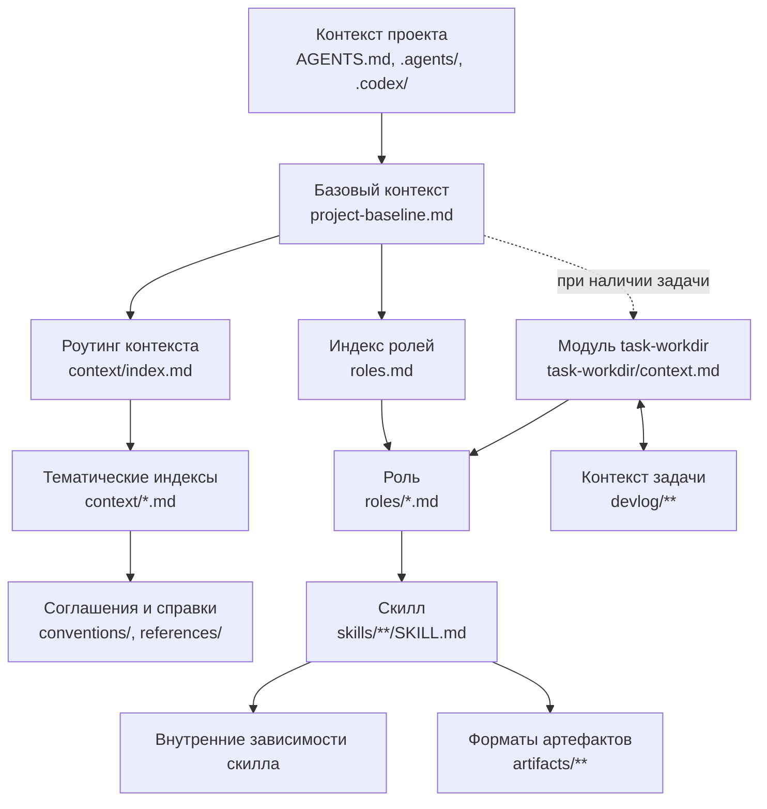

# ErgocodeAI Agent Framework

ErgocodeAI учит ваших ИИ-агентов работать по [Эргономичному подходу](https://ergowiki.azhidkov.pro/):

1. вести разработку через тесты (TDD);
2. писать быстрые, надёжные и устойчивые к рефакторингу тесты;
3. разделять сложную логику (бизнес-логику, вычисления, трансформации) и ввод-вывод (действия, эффекты);
4. декомпозировать систему на небольшие сфокусированные модули с низкой сцепленностью;

> [!WARNING]
> Фреймворк находится в активной разработке.
> Структура, контракты скиллов и процесс установки могут изменяться без обратной совместимости.

> [!NOTE]
> На данный момент соглашения, примеры и готовые процессы в первую очередь ориентированы на Kotlin и Spring Boot.
> Общие архитектурные и процессные идеи не зависят от стека, но их применение с другими технологиями потребует адаптации контекста.

> [!NOTE]
> На данный момент фреймворк ориентирован в первую очередь на Codex и модели OpenAI.

## Варианты использования фреймворка

Фреймворк поддерживает два способа использования:

1. Prompt-driven — вы ставите задачи как привыкли, агент автоматичски применяет релевантные соглашения фреймворка.
2. Skill-driven — вы явно выбираете скилл для решения очередной задачи.

Помимо этого вы можете взять фреймворк в качестве основы, а потом "доработать напильником" или полностью заменить отдельные его части: разделение на роли, роутинг контекста, конвенции дизайна и кодирования, конвенции процесса работы, скиллы и артефакты.

### Работа с фреймворком в Skill-driven варианте

Вызывайте готовые скиллы явно, самостоятельно выбирая нужные действия и их порядок.

Базовый поток реализации одного изменения:

1. Спроектировать тест-кейс проверки наблюдаемого поведения через [`$design-test-case`](src/skills/design-test-case/SKILL.md).
2. Закодировать кейс через [`$code-test-case`](src/skills/code-test-case/SKILL.md).
3. Реализовать кейс минимальным изменением production-кода через [`$fix-red-case`](src/skills/fix-red-case/SKILL.md).
4. Выполнить рефакторинг через [`$refactor-case`](src/skills/refactor-case/SKILL.md).

Перед основным циклом при необходимости можно описать API через [`$describe-rest-api`](src/skills/describe-rest-api/SKILL.md) или найти связанные участки кода через [`$collect-code-anchors`](src/skills/collect-code-anchors/SKILL.md).

### Работа по спецификации задачи

В Skill-driven варианте реализацию задачи можно вести по спецификации.
Но в отличие от традиционного SDD, в ErgocodeAI используется более лёгкий и гибкий подход — на первом этапе описываются только основные треобования, а так же общие направление и ограничения решения.

Затем, по мере реализации, спецификации задачи и решения дополняются деталями или даже сущственно меняются, если в процессе реализации выяснилось, что первоначальный план оказался неудачным.

#### Подготовка задачи

1. Подготовьте рабочую директорию с помощью [`$prepare-task-workdir`](src/task-workdir/skills/prepare-task-workdir/SKILL.md).
   Скилл в диалоге заполняет `010-task-brief.md`, при необходимости собирает `020-code-anchors.md`, формирует варианты решения и после явного выбора заполняет `030-solution-brief.md`.
2. При необходимости добавьте другие артефакты `010-*`, `020-*` и `030-*` с существенными сведениями о задаче, текущей реализации и целевом решении.
3. При необходимости добавьте стартовые задачи в todo.md.

>[!NOTE]
> **Коды артефактов**
>
>Код в начале имени файла обозначает назначение артефакта в рабочей директории задачи:
>
>- `010-*` — постановка задачи: требования и исходные материалы;
>- `020-*` — описание текущего состояния системы;
>- `030-*` — описание целевого состояния и выбранного решения;
>- `040-*` — рабочие файлы реализации.

Файл `todo.md` хранит прогресс реализации и используется без числового кода.
Полный контракт рабочей директории описан в [соглашении о задачах](src/task-workdir/context.md).
Для создания пустой рабочей директории без подготовки брифов используйте [`$init-task-workdir`](src/task-workdir/skills/init-task-workdir/SKILL.md).

Минимальная директория задачи имеет следующий вид:

```text
devlog/123-example-task/
├── 010-task-brief.md
├── 030-solution-brief.md
└── todo.md
```

После сбора первичной спецификации итеративно выполняйте шаги до завершения реализации задачи.

#### Поток реализации одного шага задачи

1. Выбрать следующий минимальный инкремент из спецификации и `todo.md` ([`$select-next-increment`](src/task-workdir/skills/select-next-increment/SKILL.md)).
2. Спроектировать и записать тест-кейс проверки целевого поведения в `030-test-cases-new.md` ([`$design-test-case`](src/skills/design-test-case/SKILL.md)).
3. Закодировать тест ([`$code-test-case`](src/skills/code-test-case/SKILL.md)).
4. Реализовать кейс ([`$fix-red-case`](src/skills/fix-red-case/SKILL.md)).
5. Отрефакторить реализацию ([`$refactor-case`](src/skills/refactor-case/SKILL.md)).
6. Обновить `todo.md`.

Итерации выполняются вручную: самостоятельно выбирайте следующее действие, вызывайте соответствующий скилл и обновляйте рабочие файлы задачи.

## Доработка контекста

В случае если агент допустил ошибку, используйте `$fix-project-context` или `$fix-framework-context` для коррекции контекста, чтобы предотвратить повторение ошибки в будущем.

- [`$fix-project-context`](src/skills/fix-project-context/SKILL.md) изменяет `AGENTS.md`, `.agents/**`, `.codex/**` и другие agent-facing инструкции конкретного проекта, не затрагивая runtime-контекст Ergocode.
- [`$fix-framework-context`](src/skills/fix-framework-context/SKILL.md) изменяет общий runtime-контекст ErgocodeAI под `src/**`;

Передайте выбранному скиллу описание проблемы, требуемое поведение и, при наличии, id Codex-сессии с примером неправильной работы:

```text
Используй $fix-project-context.

codex session id: <необязательно>
problem: <что в текущем контексте приводит к неправильной работе агента или что агент сделал не так в сессии Codex>
target behavior: <как агент должен действовать после изменения>
```

## Устройство фреймворка

Фреймворк разделяет базовый контекст, ответственность агента, инженерные правила, исполняемые процессы и память конкретной задачи.



Baseline активирует модуль task-workdir только при явном указании задачи, cwd внутри её рабочей директории или уверенном совпадении запроса, ветки и задачи.
Само наличие директорий в `devlog/` модуль не активирует.
После разрешения задачи модуль передаёт выбранной роли конкретные привязки артефактов, а роль вызывает generic-скиллы с явными смысловыми входами и путями результатов.
Baseline отдельно запускает корневой индекс контекста, который классифицирует фактическую запрошенную и запланированную работу и загружает все подходящие тематические индексы.
Роли задают ответственность и границы поведения, а generic-скиллы загружают только зависимости, внутренне необходимые их собственному контракту.

| Слой | Назначение |
| --- | --- |
| `bootstrap/` | Устанавливает фреймворк в целевой репозиторий и подключает обязательный `SessionStart` hook. |
| `src/project-baseline.md` | Задаёт минимальные правила загрузки контекста и работы с задачами. |
| `src/roles/` | Определяет ответственность и границы текущей роли агента. |
| `src/context/` | Выбирает применимые инженерные соглашения по фактической работе и объединяет независимые тематические контексты. |
| `src/conventions/` | Хранит архитектурные, кодовые, тестовые и процессные соглашения. |
| `src/skills/` | Содержит generic-скиллы с явными смысловыми входами и выбранными вызывающей стороной результатами. |
| `src/task-workdir/` | Содержит условный контекст, task-workdir-скиллы и шаблоны стандартных артефактов задачи. |
| `src/artifacts/` | Задаёт форматы проверяемых промежуточных результатов. |
| `devlog/` целевого проекта | Хранит постановку, анализ, целевое решение и прогресс конкретной задачи. |
| `AGENTS.md` целевого проекта | Интегрирует фреймворк с проектными и локальными правилами. |

Каждый файл в `src/conventions/` объявляет в YAML front matter от одного до трёх ключевых слов.
Ключевые слова образуют пересечение: каждое правило файла относится ко всем объявленным словам, а правила с другим пересечением находятся в отдельном файле и маршрутизируются независимо.

## Поддерживаемые агенты

Установка и runtime-интеграция сейчас поддерживают только Codex.
Для других агентов фреймворк скорее всего придётся адаптировать.

Для адаптации фреймворка другой агент должен уметь:

- загружать репозиторные инструкции и дополнительные Markdown-файлы по ссылкам;
- резолвить символические ссылки;
- выбирать и явно исполнять процессы, описанные в `SKILL.md`;
- выполнять startup hook или предоставлять эквивалентный механизм загрузки baseline-контекста;

## Установка для Codex

1. Добавьте репозиторий фреймворка в целевой проект.
   Рекомендуемый вариант — Git submodule в `.agents/ergo`:

   ```bash
   git submodule add https://github.com/ergonomic-code/dot-agents.git .agents/ergo
   ```

   Также можно скопировать репозиторий или создать symlink на него.
2. Попросите Codex выполнить установочный скилл:

   ```text
   Install the framework in this repository using [SKILL.md](.agents/ergo/bootstrap/skills/installing-framework/SKILL.md).
   ```

3. Ответьте на вопросы установщика о расположении framework config, если они появятся.

Установщик идемпотентно обновляет framework-секцию в `AGENTS.md`, подключает generic-скиллы через `.agents/skills/ergo`, task-workdir-скиллы через `.agents/skills/ergo-task-workdir` и настраивает Codex hook, сохраняя несвязанные проектные инструкции.
Обе коллекции подключаются отдельными прямыми symlink, поэтому установка не зависит от рекурсивного обнаружения скиллов.

## Generic-скиллы

| Скилл | Назначение |
| --- | --- |
| [`$code-test-case`](src/skills/code-test-case/SKILL.md) | Материализует одну выбранную проверку в привязанном репозитории как компилируемый Kotlin JUnit-тест и возвращает `expected-red`, `already-green` или `blocked` с доказательствами. |
| [`$collect-code-anchors`](src/skills/collect-code-anchors/SKILL.md) | Находит связанные с требуемым поведением участки кода, модели, запросы, таблицы, конфигурацию и другие якоря в коде. |
| [`$describe-rest-api`](src/skills/describe-rest-api/SKILL.md) | Пишет и валидирует человекочитаемое описание REST API по коду, OpenAPI, требованиям или другим входным данным. |
| [`$design-test-case`](src/skills/design-test-case/SKILL.md) | Проектирует одну проверку размером с тестовый метод и при заданном пути записывает её в артефакт. |
| [`$fix-framework-context`](src/skills/fix-framework-context/SKILL.md) | Анализирует и после выбора варианта изменяет общий runtime-контекст Ergocode. |
| [`$fix-project-context`](src/skills/fix-project-context/SKILL.md) | Анализирует и после выбора варианта изменяет agent-facing контекст конкретного проекта. |
| [`$fix-red-case`](src/skills/fix-red-case/SKILL.md) | Изменяет production-код, чтобы сделать зелёным один красный Kotlin JUnit-тест. |
| [`$refactor-case`](src/skills/refactor-case/SKILL.md) | Полностью проверяет один зелёный TDD-инкремент, группирует совместимые узкие рефакторинги и сообщает оставшиеся кандидаты. |
| [`$write-verification-check`](src/skills/write-verification-check/SKILL.md) | Описывает один тест-кейс в стандартном Gherkin-подобном формате. |

## Task-workdir-скиллы

Эти скиллы сохраняют знание структуры `devlog/**`, стандартных имён артефактов и правил прогресса.

| Скилл | Назначение |
| --- | --- |
| [`$init-task-workdir`](src/task-workdir/skills/init-task-workdir/SKILL.md) | Создаёт директорию задачи `devlog/NNN-slug` с обязательными рабочими файлами из шаблонов. |
| [`$prepare-task-workdir`](src/task-workdir/skills/prepare-task-workdir/SKILL.md) | В диалоге подготавливает бриф задачи, якори в коде и выбранное направление решения. |
| [`$select-next-increment`](src/task-workdir/skills/select-next-increment/SKILL.md) | Выбирает следующий минимальный нереализованный вертикальный инкремент. |
